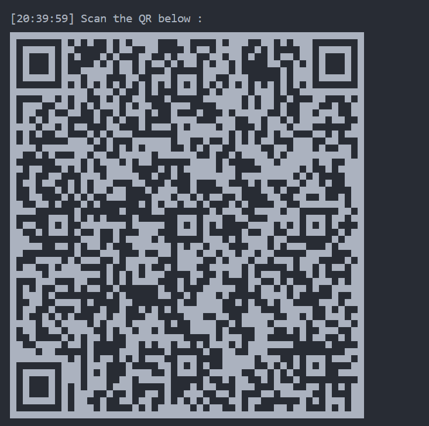
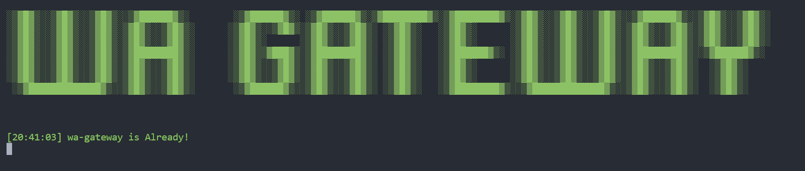

# WA-Web Gateway API


## Description

WA Web is a Node.js application that provides a web interface for WhatsApp Web using the WhatsApp Web API wrapper `whatsapp-web.js`.

> 🔔 INFO
>
> 'NodeJS v12 or higher is required'

## Installation

1. Clone this repository.

```javascript
git clone https://github.com/nandasafiqalfiansyah/wa-gateway-api.gits
```

2. Navigate to the project directory.

3. Run `npm install` to install the dependencies.

## Usage

- Run `npm start` to start the server in production mode.
- Run `npm run dev` to start the server in development mode using Nodemon.
- The application will be accessible at `http://localhost:5000` by default.
- You need to have a `.env` file in the root directory with the required environment variables. Example:

## Dependencies

- `express`: Web framework for Node.js.
- `whatsapp-web.js`: WhatsApp Web API wrapper.
- `body-parser`: Middleware to parse incoming request bodies.
- `cors`: Middleware for enabling Cross-Origin Resource Sharing (CORS).
- `dotenv`: Module to load environment variables from a `.env` file.
- `nodemon`: Development utility that automatically restarts the server when changes are detected.
- `qrcode-terminal`: Displays QR codes in the terminal.

## Scan QR



## is Already!



## Features Table 📝

| Features                                    | Status |
| ------------------------------------------- | ------ |
| Image to Sticker                            | ✅     |
| Video to Sticker                            | ✅     |
| Gif to Sticker                              | ✅     |
| Sticker to Image                            | ✅     |
| Sticker to Video                            | ❎     |
| Change Sticker Name & Sticker Author        | ✅     |
| Prefix can be set in the config/config.json | ✅     |
| Supports Reply Image to Sticker             | ✅     |
| Supports Reply Video to Sticker             | ✅     |
| Supports Reply Gif to Sticker               | ✅     |
| Supports Reply Stickers to Images           | ✅     |

## Commands Table 📝

| Commands                   | Description                                                                                                                                                     |
| -------------------------- | --------------------------------------------------------------------------------------------------------------------------------------------------------------- |
| !sticker                   | Membuat Gambar/Video/Gif menjadi Stiker. Anda juga dapat mengirim Gambar/Video/Gif menjadi Stiker langsung tanpa Command. [dalam keterangan atau pesan balasan] |
| !image                     | Membuat Stiker menjadi Gambar. Anda juga dapat mengirim Stiker menjadi Gambar langsung tanpa Command. [dalam pesan balasan]                                     |
| !change <name> \| <author> | Mengubah Nama Stiker & Penulis Stiker sesuai keinginan. [dalam pesan balasan]                                                                                   |

## Contribution

Feel free to contribute by opening a pull request or reporting issues on the [GitHub repository](https://github.com/nandasafiqalfiansyah).

## buymeacoffee

<a href="https://www.buymeacoffee.com/nandasafiqx" target="_blank"></a>

## License

Licensed under the [MIT License](LICENSE).
